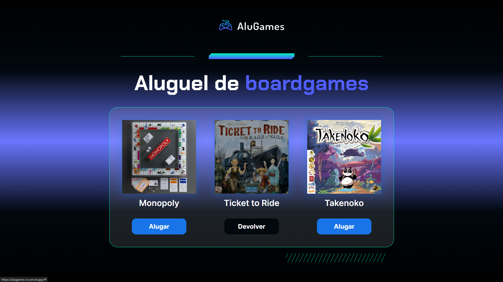

## Visão Geral

### O projeto

- Dar interatividade aos botões para que eles alternem entre Alugar e Devolver
- Dar efeito visual caso o jogo estiver alugado

### Screenshot

### Links

- Live Site URL: [AluGames](https://alugames-xi.vercel.app/)

## Meu processo

### Criado com

- JavaScript
- HTML e CSS fornecidos pelo curso

### O que eu aprendi

- Manipular o DOM
- Usar if e else

## Autor

- GitHub - [João Metzdorf](https://github.com/joaometzdorf)
